# Developer Map — DADA design log

## Traversal Plan
Brief: redesign the infrastructure map as a developer-native exploration workbench and reconcile its concepts and direct relationships without losing original evidence.
Mode: **Adaptive**: a public developer learning tool must be both distinctive and usable. Governing criterion: MAYA: Most Advanced Yet Acceptable (Raymond Loewy).

### Tooling inventory / preflight
- Registry searched for graph, Mermaid, diagram, workflow, task, and orchestration tooling. No dedicated graph query/render tool exposed; use a small local parser for the provided Mermaid edge list, and a marked Mermaid graph in this log.
- Workflow tracking: progress_card, with the frontier checklist below for individual moves and panel rounds.
- Independent critics: sessions_spawn / collector agents, one independent report per critic.
- Implementation: file tools and shell; retain the existing static app, Canvas renderer, D3 force layout and Node tests instead of introducing a framework or graph stack.
- Visual verification: Playwright Chromium (temporary QA harness) and screenshots; jsdom retained for fast regressions.
- Persistence: this versioned log plus docs/DATA-AUDIT.md and test evidence.

### Seed and exact chains
Stance: The Art of Looking Sideways (Alan Fletcher). Rules: The Elements of Typographic Style (Robert Bringhurst) →[canon for] Thinking with Type (Ellen Lupton) →[Letter Text Grid leads to] Grid Systems in Graphic Design (Josef Müller-Brockmann). Breaker: Making and Breaking the Grid (Timothy Samara) -.->[loosens] Grid Systems in Graphic Design (Josef Müller-Brockmann). Stance reached from Art as Technique (Viktor Shklovsky) →[making strange for] The Art of Looking Sideways (Alan Fletcher); same incoming node →[making strange for] Making and Breaking the Grid (Timothy Samara). MAYA →[bounds the break of] Making and Breaking the Grid (Timothy Samara).

Panel: Critic: Provocateur (Debord, Shklovsky); Critic: Inclusion (Holmes, Mace); Critic: Usability (Krug, Nielsen); Critic: Evidence (Tufte, Cairo); Critic: Craft (Sennett, Bringhurst). The Provocateur and Usability critics are joined by dotted counterpoints.
Artist question for each round: does this feel like a real developer exploration tool, and can a newcomer still identify an actual relationship and its provenance? Artist permission: grounded critical opinions are invited after statements of meaning and neutral questions.

## Frontier
One-hop edge inventory is generated in docs/design-frontier.md from the exact reference graph, including incoming and outgoing edges. Candidate outcomes tracked there and below.
- [x] M1 KEEP-THE-RULE: semantic identity, explicit curation, provenance and direct neighbors. Reached via Evidence → graphical integrity → The Visual Display of Quantitative Information (Edward Tufte).
- [x] M2 BREAK: graph-first developer workbench, terminal query as an interactive diagram rather than a decorative hero. Reached via Art as Technique → making strange for → Making and Breaking the Grid.
- [x] M1/M2 panel and interaction merge: data distinctions must read in the new interface.
- [x] M3 ambition push: elevate real relationship traversal into the leading interaction, not merely reskin.
- [x] WHOLE rounds until no objections/new frontier items remain in two consecutive rounds.

## Move M1: Canonical concepts, original evidence (KEEP-THE-RULE)
Depends on: none.
Anchors: Stance The Art of Looking Sideways (Alan Fletcher) | Rule Grid Systems in Graphic Design (Josef Müller-Brockmann) | Breaker Making and Breaking the Grid (Timothy Samara) | Counterpoint Grid Systems in Graphic Design (Josef Müller-Brockmann), dotted edge from Making and Breaking the Grid (Timothy Samara). Evidence anchor The Visual Display of Quantitative Information (Edward Tufte).
Intent: make conceptual neighborhoods represent meaning rather than accidental source IDs.
Formal argument: explicit identity decisions organize a common coordinate system; source variants and relation verbs stay accessible, so connectivity does not masquerade as certainty.
Alternatives rejected: label-only fuzzy merging risks combining distinct concepts; connecting every domain to every other domain invents relations rather than explaining them.
Consequence: canonical IDs need backward alias resolution and tests; editorial edges need visible labels and evidence.
Fence: source isolation prevents accidental conflation; break isolation only with explicit reviewed aliases.
Frontier effect: alias search, old URL resolution, source badge accuracy, meaningful default neighborhood.
Advanced pole: cross-source navigation using The Art of Looking Sideways (Alan Fletcher). Acceptable pole: traceable graphical integrity using The Visual Display of Quantitative Information (Edward Tufte).

## Move M2: Infrastructure workbench (BREAK)
Depends on: M1 for live relationship counts, but shell can be implemented in parallel.
Anchors: Stance The Art of Looking Sideways (Alan Fletcher) | Rule The Elements of Typographic Style (Robert Bringhurst) and Grid Systems in Graphic Design (Josef Müller-Brockmann) | Breaker Making and Breaking the Grid (Timothy Samara) | Counterpoint Grid Systems in Graphic Design (Josef Müller-Brockmann), dotted edge from Making and Breaking the Grid (Timothy Samara).
Intent: replace the generic marketing landing page with an instrument: graphite surfaces, sharp panes, acid-lime syntax, restrained monospace, visible identifiers, searchable relationships.
Formal argument: bring the actual graph and relationship query into the opening viewport; use typography and spacing to make developer density navigable.
Alternatives rejected: a neon cyberpunk terminal would privilege theater over reading; an oversized editorial poster would postpone the working graph and obscure its purpose. Only the instrument direction is a plausible Breaker for this brief, so no competing branch spike is selected.
Consequence: density increases; explicit labels, contrast, native controls, mobile stacking, and text alternatives are required.
Fence: the marketing hero supplies an introduction; retain a compact clear promise while breaking its dominance.
Frontier effect: readable canvas versus inspector competition; visible connection trail and labels; keyboard and mobile access.
Advanced pole: Making and Breaking the Grid (Timothy Samara), workbench rather than landing page. Acceptable pole: Thinking with Type (Ellen Lupton), clear hierarchy and native search.

## Anchor Ledger
See the reviewed Anchor Ledger below and the final convergence record.

## Compliance Check
See Final convergence and compliance below for completed checks and explicit limitations.

## Panel, M1/M2, round R1
Artifacts: initial rendered desktop, Docker selection and 390px mobile screenshots (review-media first iteration; final captures supersede them). Independent collector critics viewed screenshots via view_image.

| Critic | Anchor used | Observed in work | Verdict | Requested change |
|---|---|---|---|---|
| Provocateur | Art as Technique (Viktor Shklovsky) | Terminal identity convincing; highlighted edge and evidence card disagree | OBJECT | Coordinate exact edge, status and proof |
| Usability | Don't Make Me Think (Steve Krug) | Docker neighborhood labels overlap; desktop hero delays graph | OBJECT | Reduce label density, compact intro, restore mobile nav |
| Evidence | The Visual Display of Quantitative Information (Edward Tufte) | runs_and_manages incorrectly styled Same platform | OBJECT | Correct semantic legend and evidence continuity |
| Craft | The Elements of Typographic Style (Robert Bringhurst) | Relevant legend is tiny; overlapping node text | OBJECT | Readable hierarchy, active pair priority |
| Inclusion | Mismatch: How Inclusion Shapes Design (Kat Holmes) | Mobile navigation absent and evidence continuity unclear | OBJECT | Restore navigation and align textual relationship |

Statements of meaning: a developer instrument with inspectable evidence, undermined by a spectacle of dense edges. Artist question: can newcomers follow a real relationship and provenance? Answer: only partly. Neutral questions: which edge corresponds to the evidence card, and where does a mobile reader find navigation? Opinions: permission granted in Traversal Plan; substantive objections listed above. Andon: YES.

### ADAPT / frame swap (before additional moves)
Three or more critics objected to the same graph-to-evidence region. Replace a whole-neighborhood-as-emphasis frame with a one-relationship-as-emphasis frame. Existing edge: The Visual Display of Quantitative Information (Edward Tufte) →[names] Tufte Style; Progressive Disclosure (incoming via Envisioning Information) will separate the selected relation from the complete field. This is a frame swap rather than endless polishing of dense labels. M2 depends on M1 and is REOPENED; the interaction merge remains OPEN until re-review.
- ADAPT M1 presentation: classify curated semantic links as Editorial, not identity; preserve actual predicate.
- ADAPT M2: active edge card shows the exact highlighted subject/predicate/object and links to that relationship record; prioritize endpoint labels and collision-test other labels. Compress oversized inherited hero rules and restore mobile navigation.
- Re-render and rerun all critics. No new move until Andon is resolved.

## Panel, M1/M2 adaptation, round R2
Artifacts: re-rendered desktop, Docker active edge, mobile home. Five independent critics viewed the actual captures.

| Critic | Anchor | Observed evidence | Verdict | Requested change |
|---|---|---|---|---|
| Provocateur | Art as Technique (Viktor Shklovsky) | Distinctive relational field plus matching editorial explanation | PASS | None blocking |
| Inclusion | The Principles of Universal Design (Ronald Mace et al.) | Mobile navigation visible; textual edge duplicates graph meaning | PASS | Interaction verification remains outside screenshot scope |
| Usability | Don't Make Me Think (Steve Krug) | Docker → Container and predicate agree between edge and card | PASS | Verify evidence destination |
| Evidence | Beautiful Evidence (Edward Tufte) | Editorial status explicit; no false source equivalence | PASS | Verify documentary retrieval |
| Craft | The Elements of Typographic Style (Robert Bringhurst) | Active labels clear, hierarchy serves meaning | PASS | Optional secondary type enlargement (applied) |

Statements of meaning: a connected infrastructure instrument distinguishing records from interpretation. Artist question answered yes for visible state. Neutral questions: do evidence links work and does mobile selection retain parity? Opinions permitted; no blocking visual objection. Andon: no; R1 Andon RESOLVED through ADAPT and frame swap. M1/M2 and their interaction merge are settled pending whole-artifact QA. Automated accessibility found source-download links distinguishable only by color; ADAPT adds underlines and reruns tests.

## Move M3: A live relationship instrument (BREAK / ambition push)
Depends on: M1, M2.
Anchors: Stance The Art of Looking Sideways (Alan Fletcher) | Rule Thinking with Type (Ellen Lupton) | Breaker Making and Breaking the Grid (Timothy Samara) | Counterpoint Grid Systems in Graphic Design (Josef Müller-Brockmann), dotted from Making and Breaking the Grid (Timothy Samara). Additional visited anchor Progressive Disclosure, reached through Envisioning Information (Edward Tufte) →[layering and separation].
Intent: escalate the workbench from styled neighborhood exploration to an explicit selected-edge instrument. Make the trace itself switchable, show direction and provenance immediately, and keep a keyboard-readable relationship list.
Formal argument: a live focused-edge mode removes background topology from the immediate reading task without deleting it; neighborhood and whole-field contexts remain explicit alternative views. This pushes the break further while providing the acceptable pole through disclosure.
Alternatives rejected: a terminal command interpreter would increase learning burden; hiding all other data permanently would misrepresent completeness.
Consequence: state must reset predictably across selection/fit and controls need pressed states; evidence card must remain synchronized.
Fence: showing the full network preserves context. Break its default dominance only after selecting a concrete edge, with a visible reversible toggle.
Frontier effect: focused-edge/neighborhood switch, mobile selection, exact evidence navigation, alias and ambiguity routes all require interaction QA.
Advanced pole: Making and Breaking the Grid (Timothy Samara), graph transformed into a readable relation instrument. Acceptable pole: Progressive Disclosure, explicitly reversible focused context.

## Anchor Ledger — after R2 and M3 implementation

| Anchor | Role | Status | Evidence | Strongest objection survived / note |
|---|---|---|---|---|
| The Art of Looking Sideways (Alan Fletcher) | Stance | KEEP | Cross-source neighbors and real query entry | Lateral connections must not invent equivalence; explicit curation preserves distinction |
| The Elements of Typographic Style (Robert Bringhurst) | Rule | ADAPT | Compact mono hierarchy, enlarged decoding legend | Initial headline and tiny legend compromised content; corrected in R2 |
| Thinking with Type (Ellen Lupton) | Rule | KEEP | Pane labels, identifiers and prose hierarchy | Developer styling must not replace plain explanation |
| Grid Systems in Graphic Design (Josef Müller-Brockmann) | Rule/counterpoint | KEEP | Stable graph/inspector panes; mobile stack | Breaking landing-page hierarchy still needs predictable control placement |
| Making and Breaking the Grid (Timothy Samara) | Breaker | ADAPT | Live relation instrument with reversible active-edge focus | Whole-neighborhood emphasis hid meaning; frame swapped after R1 |
| Art as Technique (Viktor Shklovsky) | Incoming grounding | KEEP | Relational field remains unusual, with explicit textual explanation | Visual spectacle alone failed R1; exact edge correspondence repaired it |
| MAYA: Most Advanced Yet Acceptable (Raymond Loewy) | Governing criterion | KEEP | Independent R2 PASS across all five roles | Novelty cannot excuse inaccessible meaning |
| The Visual Display of Quantitative Information (Edward Tufte) | Evidence | KEEP | Original records preserved, editorial assertions labeled | False Same platform encoding rejected and removed |
| Beautiful Evidence (Edward Tufte) | Evidence expansion | KEEP | Exact relation proof with primary-source links | Screenshot status is not retrieval proof; browser test verifies destination/focus |
| Envisioning Information (Edward Tufte) | Disclosure grounding | KEEP | Active edge stands out from subdued topology | Do not delete context; reversible Neighborhood control |
| Progressive Disclosure | Frame swap / merge | KEEP | Same data at edge, neighborhood, full record levels | Hidden context must remain reachable |
| Mismatch: How Inclusion Shapes Design (Kat Holmes) | Inclusion | KEEP | Canvas-free relationship buttons and index | Initial mobile navigation absence corrected |
| The Principles of Universal Design (Ronald Mace et al.) | Inclusion expansion | KEEP | Redundant text and graphic relationship meanings | Selected evidence must not rely on precise tracing |
| Don't Make Me Think (Steve Krug) | Usability | KEEP | Plain predicate, exact evidence action and native controls | Initial edge/inspector mismatch corrected |
| Tufte Style | Frame swap grounding | KEEP | Reduced foreground noise without erased data | Graph complexity alone is not useful information |
| Critic: Provocateur (Debord, Shklovsky) | Critic | KEEP | Independent R1/R2 reports | Developer identity retained while removing ambiguity |
| Critic: Inclusion (Holmes, Mace) | Critic | KEEP | Independent R1/R2 reports | Navigation parity and textual meaning demanded |
| Critic: Usability (Krug, Nielsen) | Critic | KEEP | Independent R1/R2 reports | Exact next action tested rather than inferred |
| Critic: Evidence (Tufte, Cairo) | Critic | KEEP | Independent R1/R2 reports | Semantic conflation vetoed |
| Critic: Craft (Sennett, Bringhurst) | Critic | KEEP | Independent R1/R2 reports | Label collisions and inadequate type scale corrected |

### Live graph
See docs/design-anchors.mmd; source labels validated against the installed graph. Marked Mermaid fallback is used because no dedicated graph renderer was exposed. Frontier disposition: docs/design-frontier.md. Whole-artifact rounds completed; see final convergence.

## Final convergence and compliance

### Whole-artifact review 1
All five independent critics — Provocateur, Inclusion, Usability, Evidence, and Craft — returned PASS after the M3 ambition push. They inspected the desktop, active relationship, mobile, evidence, routes, and catalog captures plus recorded verification. The query, highlighted edge, inspector, and evidence now express the same relationship. Editorial additions remain distinguished from original source assertions. No required frontier item, Andon, or frame change was opened. A stale QA-status observation was resolved against the completed QA record, without a design change.

### Whole-artifact review 2
A second independent whole-artifact round returned PASS from all five critics without an intervening artifact change. No required new frontier or dependency was opened. Optional future refinements—less repetitive evidence metadata, larger secondary metadata, featured cross-source routes, and manual assistive-technology research—remain explicitly deferred, not claimed complete.

### Stop conditions
- S1: PASS — the frontier is exhausted for this scope; branches in docs/design-frontier.md are taken or explicitly deferred.
- S2: PASS — the entire artifact passed all five critics.
- S3: PASS — two consecutive whole-artifact rounds passed without reopening or a new required frontier.
- S4: PASS — M3's reversible active-edge emphasis and evidence-focus handoff survived both rounds.
- S5: PASS — dotted-edge dispositions are documented in the frontier and ledger.

### Double-loop reflection and graph amendment proposal
The first review exposed a semantic failure that attractive styling could hide: editorial relations had been described as “Same platform.” Visual criticism alone cannot establish graph truth. Future graph versions should make identity preservation, relation provenance, and query/graph/evidence agreement an explicit hard constraint alongside the Evidence critic. This is a project-level proposal only; the installed skill and its reference graph were not modified.

### Final compliance
Mode: Adaptive. Tooling: existing static application and Canvas/D3 renderer; Mermaid traversal/frontier artifacts; five independent critic roles; Node/jsdom tests; Chromium/Playwright interaction checks; and axe accessibility scans. No new runtime framework, remote font, image generation, or paid service was needed. Branch spikes were not applicable: alternatives were rejected with recorded reasons rather than represented as tested prototypes. Manual screen-reader and user research were not performed. All five required DADA artifacts are present: Traversal Plan (with Frontier), Decision Records, Panel Reports, Anchor Ledger, and Compliance Check. Design convergence is complete; publication remains a separately verified engineering step and is not implied by these passes.

### Final marked traversal graph

```mermaid
flowchart LR
  sideways["The Art of Looking Sideways (Alan Fletcher)"]
  bring["The Elements of Typographic Style (Robert Bringhurst)"]
  lupType["Thinking with Type (Ellen Lupton)"]
  mb["Grid Systems in Graphic Design (Josef Müller-Brockmann)"]
  samBreak["Making and Breaking the Grid (Timothy Samara)"]
  shklovsky["Art as Technique (Viktor Shklovsky)"]
  maya["MAYA: Most Advanced Yet Acceptable (Raymond Loewy)"]
  tufteV["The Visual Display of Quantitative Information (Edward Tufte)"]
  crit_prov["Critic: Provocateur (Debord, Shklovsky)"]
  crit_inc["Critic: Inclusion (Holmes, Mace)"]
  crit_use["Critic: Usability (Krug, Nielsen)"]
  crit_evid["Critic: Evidence (Tufte, Cairo)"]
  crit_craft["Critic: Craft (Sennett, Bringhurst)"]
  bring -->|canon for| lupType
  lupType -.->|popularizes| bring
  lupType -->|Letter Text Grid leads to| mb
  samBreak -.->|loosens| mb
  shklovsky -->|making strange for| samBreak
  shklovsky -->|making strange for| sideways
  maya -.->|tempers strangeness of| shklovsky
  maya -->|bounds the break of| samBreak
  sideways -->|humor as welcome for| maya
  crit_craft -->|checks type with| bring
  crit_prov -->|makes strange with| shklovsky
  crit_evid -->|checks graphical integrity with| tufteV
  crit_prov -.->|attacks smoothness favored by| crit_use
  crit_use -.->|demands clarity from| crit_prov
  classDef visited fill:#d5ff70,stroke:#263323,color:#101211
  class sideways,bring,lupType,mb,samBreak,shklovsky,maya,tufteV,crit_prov,crit_inc,crit_use,crit_evid,crit_craft visited
  classDef kept fill:#d5ff70,stroke:#263323,color:#101211
  classDef adapted fill:#ffe299,stroke:#765714,color:#101211
  class sideways,bring,lupType,mb,shklovsky,maya,tufteV,crit_prov,crit_inc,crit_use,crit_evid,crit_craft kept
  class samBreak adapted

  tufteB["Beautiful Evidence (Edward Tufte)"] -->|extends| tufteE["Envisioning Information (Edward Tufte)"]
  tufteE -->|extends| tufteV
  tufteE -->|layering and separation| c_prog["Progressive Disclosure"]
  tufteV -->|names| c_tufte["Tufte Style"]
  crit_inc -->|finds who is excluded with| holmes["Mismatch: How Inclusion Shapes Design (Kat Holmes)"]
  crit_inc -->|checks access with| mace["The Principles of Universal Design (Ronald Mace et al.)"]
  mace -->|inclusive principles for| holmes
  crit_use -->|tests first-use with| krug["Don't Make Me Think (Steve Krug)"]
  c_prog -->|approachable surface and ambitious depth for| maya
  class tufteB,tufteE,c_prog,c_tufte,holmes,mace,krug visited;
```

## Final whole-artifact panel evidence

Both final rounds assessed the rendered artifact and recorded QA evidence; panel review does not imply independently rerunning the test suite. No implementation change occurred between these rounds.

| Critic / anchor | Whole round 1 | Whole round 2 / observed evidence | Required frontier / Andon |
|---|---|---|---|
| Provocateur / Shklovsky | PASS: relationship instrument rather than decorative novelty | PASS: query → relation → evidence makes connections inspectable; a featured cross-source path is optional | None / no |
| Inclusion / Holmes and Mace | PASS: mobile navigation and textual alternatives | PASS: readable mobile navigation, semantic controls and evidence alternatives; manual assistive-technology testing remains future work | None / no |
| Usability / Krug | PASS: selection and next action stay understandable | PASS: consistent starting point, current selection and next action; mobile jump explanation is optional | None / no |
| Evidence / Tufte | PASS: source versus editorial provenance remains explicit | PASS: 768 nodes, 643 edges and 21 shared concepts are honest; 638 source plus 5 editorial edges and exact evidence are inspectable | None / no |
| Craft / Bringhurst | PASS: coherent hierarchy and selected relationship contrast | PASS: endpoint labels remain foregrounded and readable; metadata density is an optional refinement | None / no |

Artist question: does active-edge focus improve understanding without disguising provenance or erasing the neighborhood? Both rounds accepted the reversible focus and evidence handoff. Optional opinions above were not converted into mandatory work; no unresolved blocking objection remained.
