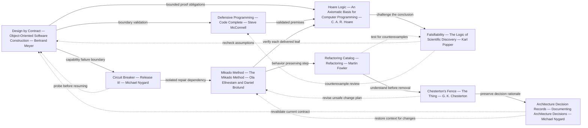

# Literature anchors and coverage

Reference reviewed on 2026-10-09: [Semantic-Anchors catalog](https://llm-coding.github.io/Semantic-Anchors/). Anchor names provide a compact vocabulary; they are not evidence that an LLM follows a formal method or guarantees correctness. Only the works/authors below are used. Each edge is an **editorial relationship in this repository's workflow**, not a quotation, historical influence claim, or endorsement by the named authors.

## Nonlinear, backreferencing graph

Only literature-backed anchor nodes appear in the graph. The coverage ledger below maps skills, procedures, resources, and adaptations into these nodes; no invented “FAIKU theorem” or “GM principle” is presented as literature.

## Existing catalog anchors

These entries were individually fetched successfully. Primary sources establish the literature/author attribution; catalog links establish that the anchor is in the requested reference. The operational application here is editorial, not a reproduction of the books.

| ID | Catalog entry | Named literature and author | Primary author/publisher source |
|---|---|---|---|
| DBC | [Design by Contract](https://llm-coding.github.io/Semantic-Anchors/anchor/design-by-contract) | *Object-Oriented Software Construction*, Bertrand Meyer | [Eiffel Software's Design by Contract and book references](https://www.eiffel.com/values/design-by-contract/) |
| DEF | [Defensive Programming according to McConnell](https://llm-coding.github.io/Semantic-Anchors/anchor/defensive-programming) | *Code Complete*, Steve McConnell | [Author's book list](https://stevemcconnell.com/books/) |
| REFACTOR | [Refactoring Catalog according to Fowler](https://llm-coding.github.io/Semantic-Anchors/anchor/refactoring-catalog) | *Refactoring: Improving the Design of Existing Code*, Martin Fowler; preserve applicable coauthor credits when discussing specific editions | [Author's refactoring site](https://refactoring.com/) |
| FENCE | [Chesterton's Fence](https://llm-coding.github.io/Semantic-Anchors/anchor/chestertons-fence) | *The Thing*, G. K. Chesterton; the parable appears in “The Drift from Domesticity” | [Primary text](https://www.gkc.org.uk/gkc/books/The_Thing.txt) |
| MIKADO | [Mikado Method](https://llm-coding.github.io/Semantic-Anchors/anchor/mikado-method) | *The Mikado Method*, Ola Ellnestam and Daniel Brolund | [Manning publisher record](https://www.manning.com/books/the-mikado-method) |
| ADR | [ADR according to Nygard](https://llm-coding.github.io/Semantic-Anchors/anchor/adr-according-to-nygard) | *Documenting Architecture Decisions*, Michael Nygard | [Author's original article](https://cognitect.com/blog/2011/11/15/documenting-architecture-decisions) |
| CIRCUIT | [Circuit Breaker](https://llm-coding.github.io/Semantic-Anchors/anchor/circuit-breaker) | *Release It!*, Michael Nygard | [Publisher's second-edition record](https://pragprog.com/titles/mnee2/release-it-second-edition/) |

## Local proposed extensions

No Hoare/Popper/falsifiability entry was found among the linked anchor titles in the catalog text reviewed on 2026-10-09. This is a bounded observation, not a claim that no related idea exists anywhere upstream. These are **local additions to this repository only**, not submitted or accepted external catalog changes.

| ID | Proposed anchor | Literature and primary source | Local use and limit |
|---|---|---|---|
| HOARE | Hoare Logic | C. A. R. Hoare, *An Axiomatic Basis for Computer Programming* (1969), [original paper hosted by Carnegie Mellon](https://www.cs.cmu.edu/~crary/819-f09/Hoare69.pdf); title/author/year and assertion semantics read on pages 1–2 | Explicit premises and result obligations. This skill does not implement a sound/complete proof engine; a self-check is not formal verification. |
| FALSIFY | Falsifiability according to Popper | Karl Popper, *The Logic of Scientific Discovery*, [publisher record](https://www.routledge.com/The-Logic-of-Scientific-Discovery/Popper/p/book/9780415278447) | Actively seek a counterexample to a claim. Applied here by analogy to audit discipline; an unrefuted answer is not proved true. |

The publisher DOI page for Hoare was access-blocked; the primary paper itself was accessible through the academic mirror and inspected. No guessed bibliographic details or full copyrighted excerpts are included.

## Procedure coverage ledger

Every numbered procedure in the two skills is mapped here. An anchor guides a procedure; it does not uniquely specify all its operational details. The explicit skill contract remains necessary.

| Procedure | Outcome | Graph nodes |
|---|---|---|
| F1 | Bounded input/output contract | DBC, ADR |
| F2 | Structural integrity/fault | DEF, DBC |
| F3 | Premise and query mapping | DBC, HOARE |
| F4 | Bounded derivation and evidence | HOARE, DBC |
| F5 | Counterexample and assumption check | FALSIFY, HOARE, DEF |
| F6 | Serialized result and invocation termination | DBC, DEF |
| P1 | Dynamic GM/MCP capability and manual fallback | DBC, DEF, CIRCUIT |
| P2 | Deduplicated repair, verified host, compaction and delivery | MIKADO, CIRCUIT, ADR, DEF |
| P3 | Recoverable AGENTS.md compaction with traceability | ADR, FENCE, REFACTOR |
| P4 | Evidence-preserving comment review/refactoring | REFACTOR, FENCE, ADR, MIKADO |
| P5 | Parallel dependency graph and completion ownership | MIKADO, CIRCUIT, DBC |
| P6 | Truthful identity and retained attribution | ADR, FENCE |
| P7 | Reference check, graph authoring and skill conversion | ADR, DBC, HOARE, FALSIFY |

## Artifact and adaptation coverage

| Added artifact/decision | Graph nodes | Connection to procedures |
|---|---|---|
| [FAIKU skill](../../.agents/skills/faiku/SKILL.md) and its fixture checklist | DBC, DEF, HOARE, FALSIFY, ADR | F1–F6 |
| [PIMP MY SKILL](../../.agents/skills/pimp-my-skill/SKILL.md) and its fixture checklist | DBC, DEF, CIRCUIT, MIKADO, REFACTOR, FENCE, ADR, HOARE, FALSIFY | P1–P7 |
| [Original request archive](ORIGINAL-REQUEST.md) | ADR, FENCE | F1, P1 |
| [Audit/adaptation ledger](AUDIT.md), decisions A1–A12 | DBC, DEF, HOARE, FALSIFY, CIRCUIT, MIKADO, ADR, FENCE, REFACTOR | Explicit per-decision mapping in that ledger |
| [Coding-agent prompt](CODING-AGENT-PROMPT.md) | ADR, DBC, HOARE, FALSIFY | P7 |
| This anchor graph, source ledger and two local extensions | ADR, HOARE, FALSIFY, DBC | F4–F5, P7 |
| [Package README](README.md) | ADR, DBC | F1, P1, P7 |
| [Validation report](VALIDATION.md) | DBC, DEF, HOARE, FALSIFY | F6, P7 |

No source graph/data in the developer-map application is modified by this documentation package. Incorporating these literature relationships into application data would be a separate, explicitly provenance-labelled integration, not an automatic inference from this Mermaid graph.
